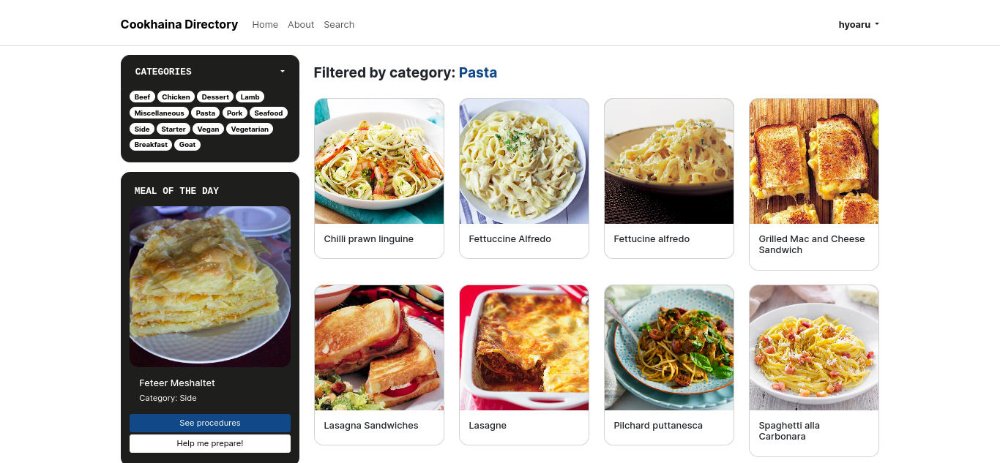

# Cookhaina directory
Cookhaina Directory is a web application that functions as a digital cookbook. It allows users to search for meals by their main ingredient or name, add them to their favorites, and share their thoughts by commenting on meals. The application is built with Flask and utilizes the API provided by The Meal DB to retrieve information about meals. 

A course requirement in CC106 - Applications Development and Emerging Technologies.

Project members: 
* Cabrera, Jen Jade
* Rubia, Johaina

See live: https://cookhaina-directory.onrender.com

## Features
* **Meal Search**: Users can search for meals based on their main ingredient or name. This feature enables users to quickly find specific recipes or explore new meal ideas.
* **Favorite Meals**: Registered users can add meals to their favorites, creating a personalized collection of preferred recipes. This feature makes it easy for users to bookmark and revisit meals they enjoyed or want to try in the future.
* **Meal Details**: Users can access detailed information about each meal, including the list of ingredients, preparation instructions, meal category, cuisine type, and more. This information helps users understand the recipe better and prepare the meal accurately.
* **Comments**: Users can leave comments on meals that they have tried. This feature allows users to share their cooking experiences, provide feedback, and engage in discussions with other community members.

## Previews

## Technologies used
Cookhaina Directory is built using the following technologies:
* **Flask**: A lightweight web framework for Python. Flask provides a simple and efficient way to build web applications and APIs.
* **HTML, CSS, JavaScript**: These are the core technologies used for building the user interface and providing interactivity.
* **Jinja**: A templating engine for Python. Jinja allows for dynamic rendering of HTML templates with Flask.
* **Bootstrap**: A popular CSS framework that provides pre-designed components and styles for creating responsive web applications.

## License
Cookhaina Directory is licensed under the [MIT License](LICENSE). Feel free to use, modify, and distribute the application according to the terms of the license.

## Acknowledgments
The Cookhaina Directory application utilizes the API provided by The Meal DB. We express our gratitude to the creators and maintainers of The Meal DB for providing a comprehensive database of meals.